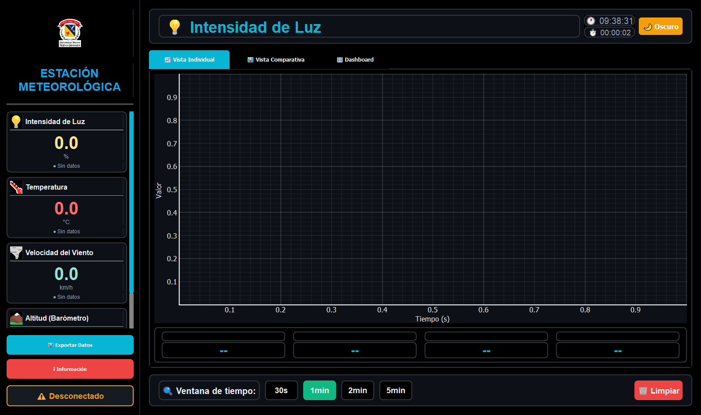

# Weather Station Monitoring System

Desktop application for real-time monitoring of an ESP32-based weather station. This project combines embedded data acquisition, WiFi communication, statistical processing, historical visualization, and a modern PyQt5 interface designed for laboratory and educational use.

[](https://www.python.org/)
[](https://pypi.org/project/PyQt5/)
[](https://www.espressif.com/)
[]()

## Interface Preview / Vista de la Interfaz



The image above shows the current layout of the application: sensor cards on the left, the live graph in the center, and control and statistics areas along the bottom. The same interface is used in the Spanish documentation below.

## Project Overview

This system receives live measurements from an ESP32 and presents them in a graphical interface with sensor cards, trend plots, alarms, statistics, and data export tools. It was developed as an academic engineering project at Universidad Militar Nueva Granada and is intended to demonstrate a complete end-to-end instrumentation workflow.

The solution is divided into two main parts:

- An ESP32 firmware that reads the sensors and exposes the data through a lightweight HTTP service.
- A Python desktop application that consumes the data, analyzes it, and displays it in real time.

## Key Features

- Real-time monitoring of four environmental variables: light intensity, temperature, wind speed, and altitude.
- PyQt5 desktop interface with a dark visual theme and responsive layout.
- Live trend charts powered by PyQtGraph.
- Sensor cards with current value, unit, and status indicator.
- Alarm system based on configurable thresholds.
- Rolling statistics for minimum, maximum, average, standard deviation, and current value.
- Data export to CSV and JSON.
- Network connectivity test utility for the ESP32.
- Modular configuration file for sensors, colors, alarms, and interface settings.

## Repository Structure

- `interfazestm.py`: main desktop interface and application entry point.
- `sensor_data.py`: data management, statistics, plotting helpers, and export routines.
- `config.py`: global configuration for sensors, UI, alarms, and communication parameters.
- `test_conexion.py`: standalone connection test for the ESP32.
- `esp32_estacion_meteorologica/`: Arduino firmware for the ESP32.
- `assets/`: visual resources used by the interface.
- `exports/`: default folder for exported datasets.

## Technologies Used

- Python
- PyQt5
- PyQtGraph
- NumPy
- Requests
- pygame, optional, for audible alarms
- Arduino framework for ESP32

## Hardware and Data Sources

The ESP32 firmware reads the following sensors:

- Light intensity sensor, reported as percentage.
- PT100 temperature measurement, calibrated in degrees Celsius.
- Anemometer, converted to wind speed in km/h.
- BMP280 barometric sensor, used to estimate altitude in meters.

The ESP32 exposes two HTTP endpoints:

- `/`: a browser-friendly HTML page with the current readings.
- `/data`: a JSON API consumed by the Python interface.

## Requirements

- Python 3.10 or newer.
- ESP32 flashed with the provided firmware.
- A WiFi network available to the ESP32.
- The ESP32 IP address configured in `config.py`.

### Python dependencies

```bash
pip install PyQt5 pyqtgraph numpy requests pygame
```

The `pygame` package is optional. If it is not installed, the application still works, but sound alarms are disabled.

## Installation

1. Clone or download the project.
2. Create and activate a virtual environment if desired.
3. Install the Python dependencies.
4. Upload the ESP32 firmware located in `esp32_estacion_meteorologica/`.
5. Update the WiFi credentials in the Arduino sketch.
6. Confirm the ESP32 IP address and set it in `config.py`.

## How to Run

1. Power on the ESP32 and make sure it connects to the same network as your computer.
2. Run the desktop application:

```bash
python interfazestm.py
```

3. Optionally validate connectivity first:

```bash
python test_conexion.py
```

## Application Workflow

1. The ESP32 samples all sensors at a fixed interval.
2. The firmware publishes the latest values through the `/data` endpoint.
3. The Python application polls the endpoint and stores incoming readings.
4. Historical values are plotted in real time.
5. Statistics are updated continuously over a rolling time window.
6. Threshold violations trigger visual alarms and optional sound alerts.
7. Data can be exported for later analysis.

## Configuration Guide

The most relevant settings are defined in `config.py`:

- `ESP32_IP`: IP address of the board on the local network.
- `ESP32_PORT`: HTTP port used by the firmware.
- `SENSORS`: sensor metadata, units, colors, thresholds, and labels.
- `GRAPH_UPDATE_RATE`: chart refresh interval.
- `ALARM_CHECK_INTERVAL`: alarm evaluation interval.
- `DEFAULT_EXPORT_PATH`: default output directory for saved files.

If the interface does not receive data, the first item to verify is the ESP32 IP address.

## Exported Data

The application supports the following export formats:

- CSV
- JSON

Exported files are generated from the readings stored during the session and include timestamps, sensor values, and statistics where applicable.

## Troubleshooting

- If the interface opens but no data appears, verify that the ESP32 is online and that `ESP32_IP` matches the board address shown in the serial monitor.
- If the connection test fails, confirm that both devices are on the same WiFi network.
- If sound alarms do not work, install `pygame` and make sure the alarm audio file exists in `assets/`.
- If export fails, check write permissions in the `exports/` folder.
- If the application does not start, verify that all Python dependencies are installed in the active environment.

## Academic and Professional Value

This project is suitable for a CV or portfolio because it demonstrates:

- Integration of embedded systems with desktop software.
- Real-time data acquisition and visualization.
- Network communication over HTTP between devices.
- Calibration and interpretation of sensor data.
- Modular software design with configuration-driven behavior.
- Practical use of scientific and engineering Python libraries.

## Credits

Academic project developed at Universidad Militar Nueva Granada.

Team members:

- Karol Daniela Mosquera
- David Santiago García Suárez
- Santiago Rubiano Garzón

---

# Sistema de Monitoreo de Estación Meteorológica

Aplicación de escritorio para el monitoreo en tiempo real de una estación meteorológica basada en ESP32. El proyecto integra adquisición de datos embebidos, comunicación por WiFi, procesamiento estadístico, visualización histórica y una interfaz moderna desarrollada con PyQt5, pensada para uso académico, de laboratorio y como proyecto de portafolio profesional.

## Descripción General

El sistema recibe mediciones en vivo desde un ESP32 y las presenta en una interfaz gráfica con tarjetas de sensores, gráficas de tendencia, alarmas, estadísticas y herramientas de exportación. Fue desarrollado como proyecto académico de ingeniería en la Universidad Militar Nueva Granada y busca mostrar un flujo completo de instrumentación de extremo a extremo.

La solución se divide en dos partes principales:

- Un firmware para ESP32 que lee los sensores y expone los datos mediante un servicio HTTP liviano.
- Una aplicación de escritorio en Python que consume los datos, los analiza y los visualiza en tiempo real.

## Funcionalidades Principales

- Monitoreo en tiempo real de cuatro variables ambientales: intensidad de luz, temperatura, velocidad del viento y altitud.
- Interfaz de escritorio desarrollada con PyQt5 y tema oscuro.
- Gráficas históricas en vivo con PyQtGraph.
- Tarjetas de sensores con valor actual, unidad y estado.
- Sistema de alarmas basado en umbrales configurables.
- Estadísticas continuas de mínimo, máximo, promedio, desviación estándar y valor actual.
- Exportación de datos a CSV y JSON.
- Utilidad de prueba de conectividad con el ESP32.
- Archivo de configuración modular para sensores, colores, alarmas y parámetros visuales.

## Estructura del Repositorio

- `interfazestm.py`: interfaz principal y punto de entrada de la aplicación.
- `sensor_data.py`: gestión de datos, estadísticas, ayudas para gráficas y exportación.
- `config.py`: configuración global de sensores, interfaz, alarmas y comunicación.
- `test_conexion.py`: prueba independiente de conexión con el ESP32.
- `esp32_estacion_meteorologica/`: firmware Arduino del ESP32.
- `assets/`: recursos visuales usados por la interfaz.
- `exports/`: carpeta por defecto para archivos exportados.

## Tecnologías Utilizadas

- Python
- PyQt5
- PyQtGraph
- NumPy
- Requests
- pygame, opcional, para alarmas sonoras
- Framework Arduino para ESP32

## Hardware y Fuentes de Datos

El firmware del ESP32 lee los siguientes sensores:

- Sensor de intensidad de luz, reportado en porcentaje.
- Medición de temperatura PT100, calibrada en grados Celsius.
- Anemómetro, convertido a velocidad del viento en km/h.
- Sensor barométrico BMP280, usado para estimar la altitud en metros.

El ESP32 expone dos endpoints HTTP:

- `/`: página HTML legible desde navegador con los valores actuales.
- `/data`: API JSON consumida por la interfaz en Python.

## Requisitos

- Python 3.10 o superior.
- ESP32 cargado con el firmware incluido.
- Una red WiFi disponible para el ESP32.
- La dirección IP del ESP32 configurada en `config.py`.

### Dependencias de Python

```bash
pip install PyQt5 pyqtgraph numpy requests pygame
```

El paquete `pygame` es opcional. Si no está instalado, la aplicación sigue funcionando, pero las alarmas sonoras quedan desactivadas.

## Instalación

1. Clona o descarga el proyecto.
2. Crea y activa un entorno virtual de Python si lo deseas.
3. Instala las dependencias de Python.
4. Carga el firmware del ESP32 ubicado en `esp32_estacion_meteorologica/`.
5. Actualiza las credenciales WiFi en el sketch de Arduino.
6. Verifica la IP del ESP32 y configúrala en `config.py`.

## Cómo Ejecutar el Proyecto

1. Enciende el ESP32 y asegúrate de que se conecte a la misma red que tu computador.
2. Ejecuta la aplicación de escritorio:

```bash
python interfazestm.py
```

3. Si deseas validar primero la comunicación, ejecuta:

```bash
python test_conexion.py
```

## Flujo de Funcionamiento

1. El ESP32 toma lecturas de todos los sensores a intervalos fijos.
2. El firmware publica los valores más recientes en el endpoint `/data`.
3. La aplicación en Python consulta ese endpoint y almacena las lecturas.
4. Los valores históricos se grafican en tiempo real.
5. Las estadísticas se actualizan continuamente sobre una ventana temporal móvil.
6. Las violaciones de umbral activan alarmas visuales y, de forma opcional, alertas sonoras.
7. Los datos pueden exportarse para análisis posterior.

## Guía de Configuración

Las opciones más importantes se definen en `config.py`:

- `ESP32_IP`: dirección IP del equipo en la red local.
- `ESP32_PORT`: puerto HTTP usado por el firmware.
- `SENSORS`: metadatos de cada sensor, unidades, colores, umbrales y etiquetas.
- `GRAPH_UPDATE_RATE`: intervalo de actualización de las gráficas.
- `ALARM_CHECK_INTERVAL`: intervalo de revisión de alarmas.
- `DEFAULT_EXPORT_PATH`: carpeta de salida por defecto para los archivos guardados.

Si la interfaz no recibe datos, lo primero que debes revisar es la IP del ESP32.

## Exportación de Datos

La aplicación soporta los siguientes formatos de exportación:

- CSV
- JSON

Los archivos exportados se generan a partir de las lecturas almacenadas durante la sesión e incluyen marcas de tiempo, valores de sensores y estadísticas cuando aplica.

## Solución de Problemas

- Si la interfaz abre pero no aparecen datos, verifica que el ESP32 esté encendido y que `ESP32_IP` coincida con la dirección mostrada en el monitor serial.
- Si falla la prueba de conexión, confirma que ambos dispositivos estén en la misma red WiFi.
- Si las alarmas sonoras no funcionan, instala `pygame` y verifica que el archivo de audio exista en `assets/`.
- Si falla la exportación, revisa los permisos de escritura en la carpeta `exports/`.
- Si la aplicación no inicia, confirma que todas las dependencias de Python estén instaladas en el entorno activo.

## Valor Académico y Profesional

Este proyecto es adecuado para incluirse en un CV o portafolio porque demuestra:

- Integración entre sistemas embebidos y software de escritorio.
- Adquisición y visualización de datos en tiempo real.
- Comunicación por HTTP entre dispositivos.
- Calibración e interpretación de datos de sensores.
- Diseño de software modular con comportamiento guiado por configuración.
- Uso práctico de librerías científicas y de ingeniería en Python.

## Créditos

Proyecto académico desarrollado en la Universidad Militar Nueva Granada.

Integrantes:

- Karol Daniela Mosquera
- David Santiago García Suárez
- Santiago Rubiano Garzón